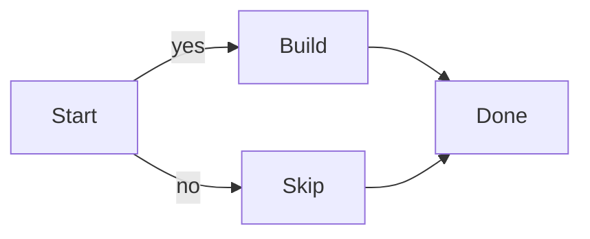
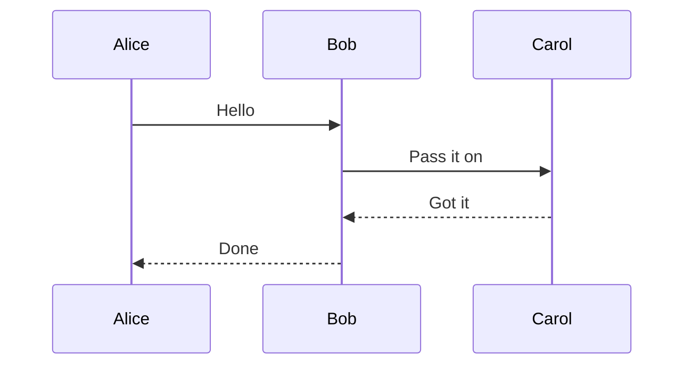
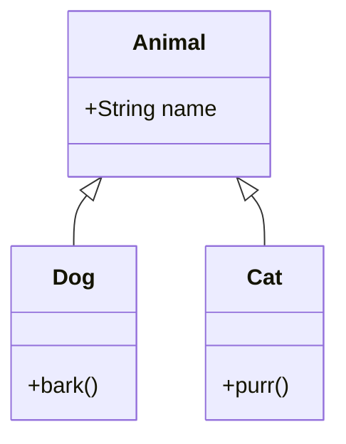
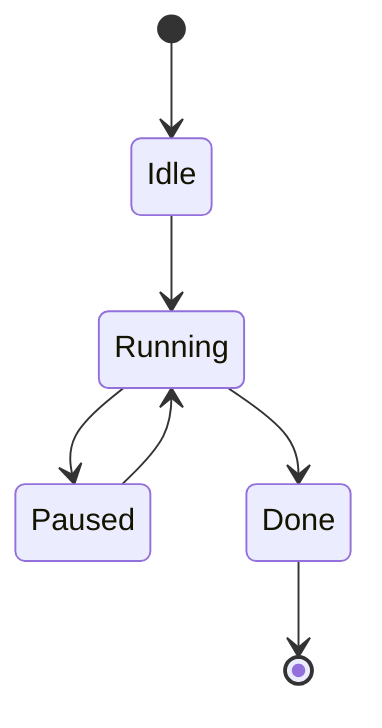
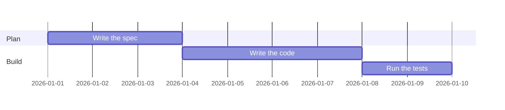
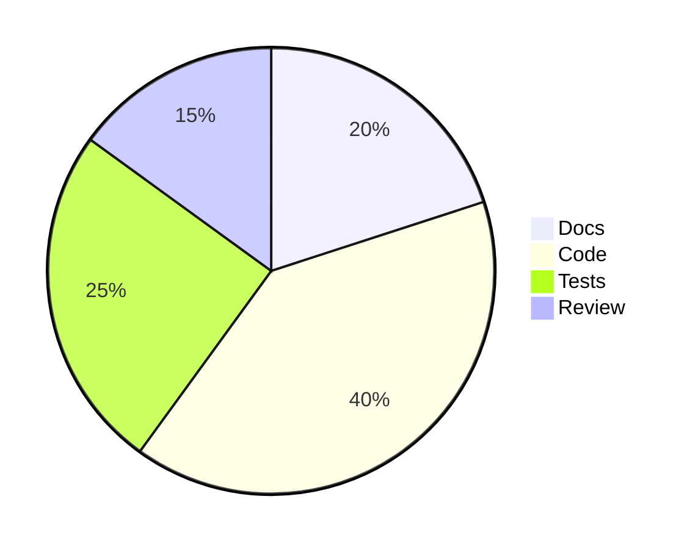

# Diagram types

One small diagram of each type, for a look at the colors of a palette.

## Flowchart

```mermaid
flowchart LR
  A[Start] -->|yes| B[Build]
  A -->|no| C[Skip]
  B --> D[Done]
  C --> D
```

## Sequence

```mermaid
sequenceDiagram
  Alice->>Bob: Hello
  Bob->>Carol: Pass it on
  Carol-->>Bob: Got it
  Bob-->>Alice: Done
```

## Class

```mermaid
classDiagram
  Animal : +String name
  Dog : +bark()
  Cat : +purr()
  Animal <|-- Dog
  Animal <|-- Cat
```

## State

```mermaid
stateDiagram-v2
  [*] --> Idle
  Idle --> Running
  Running --> Paused
  Paused --> Running
  Running --> Done
  Done --> [*]
```

## Gantt

```mermaid
gantt
  dateFormat YYYY-MM-DD
  section Plan
  Write the spec :a1, 2026-01-01, 3d
  section Build
  Write the code :a2, after a1, 4d
  Run the tests :a3, after a2, 2d
```

## Pie

```mermaid
pie
  "Docs" : 4
  "Code" : 8
  "Tests" : 5
  "Review" : 3
```
