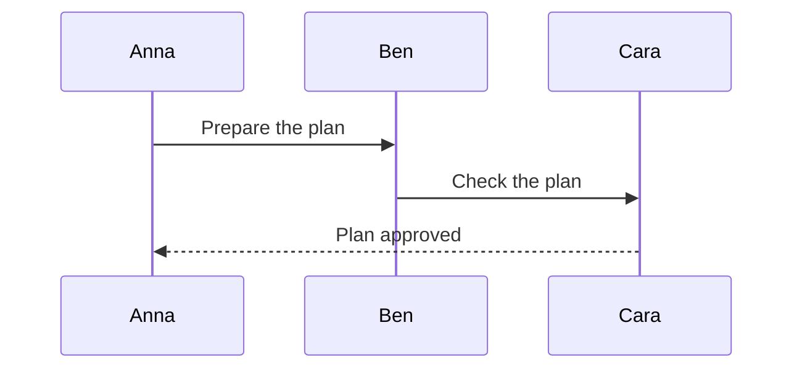

# Accent sequence fixture

One sequence diagram with three participants and messages between them:

```mermaid
sequenceDiagram
  Anna->>Ben: Prepare the plan
  Ben->>Cara: Check the plan
  Cara-->>Anna: Plan approved
```
