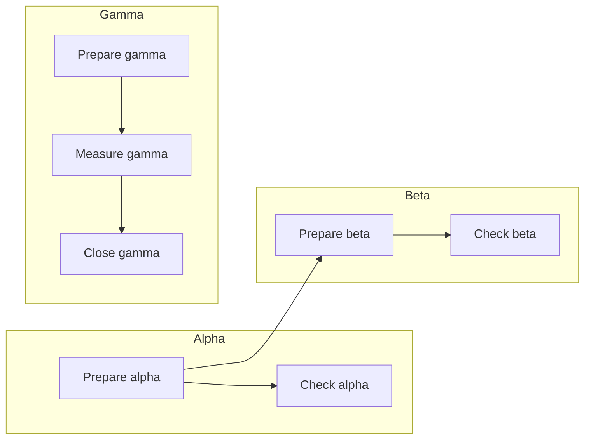

# Accent subgraphs fixture

Three subgraphs, each with its own nodes, and one edge that crosses from the
first subgraph to the second:

```mermaid
flowchart LR
  subgraph alpha[Alpha]
    a1[Prepare alpha] --> a2[Check alpha]
  end
  subgraph beta[Beta]
    b1[Prepare beta] --> b2[Check beta]
  end
  subgraph gamma[Gamma]
    g1[Prepare gamma] --> g2[Measure gamma] --> g3[Close gamma]
  end
  a1 --> b1
```
