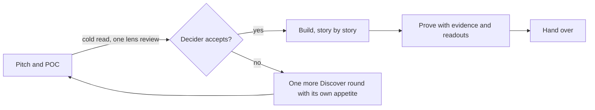

# Mermaid fixture

The situations flowchart, copied from the handbook (block 4). It is a fixture: it is not kept in sync.

```mermaid
flowchart LR
  P[Pitch and POC] -->|cold read, one lens review| G{Decider accepts?}
  G -->|yes| B[Build, story by story]
  G -->|no| R[One more Discover round with its own appetite]
  R --> P
  B --> PR[Prove with evidence and readouts] --> H[Hand over]
```
